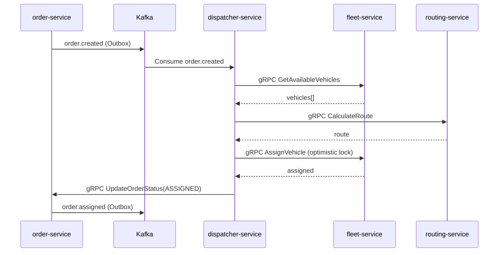

# Contracts — Межсервисные контракты

> Единственный источник правды — `libs/proto/*.proto`. Этот файл — навигационный индекс.

---

## ⚡ Когда обновлять ЭТОТ файл

Обнови СРАЗУ если:
- Добавил/изменил/удалил gRPC метод
- Добавил/изменил Kafka топик или его payload
- Изменил KafkaEvent schema

**И параллельно обнови:** `docs/COMMUNICATION.md`

---

## Правила контрактов

1. **proto-first** — контракт определяется в `libs/proto/*.proto`, не в коде
2. **Обратная совместимость** — никогда не удаляй поля, только добавляй `optional`
3. **Версионирование** — при breaking change создай новый message/service (v2)
4. **Документируй поля** — каждое поле в proto должно иметь комментарий
5. **Тестируй реальные методы** — `waitForReady()` ≠ методы работают

---

## gRPC: Полная карта вызовов

| Caller | Callee | Методы |
|--------|--------|--------|
| api-gateway | order-service | CreateOrder, GetOrder, GetOrderHistory, ListOrders, UpdateOrderStatus, CancelOrder, GetCompanySettings, SetSetting, UpdateCompanySettings |
| api-gateway | fleet-service | GetAvailableVehicles, GetVehicle, GetVehicleDetails, UpdateVehicle, AssignVehicle, ReleaseVehicle |
| api-gateway | routing-service | CalculateRoute, GetRoute, CalculateETA |
| api-gateway | tracking-service | GetLatestPosition, GetTrack, StreamVehiclePosition |
| api-gateway | counterparty-service | CreateCounterparty, GetCounterparty, UpdateCounterparty, ListCounterparties, CreateContract, GetContract, UpdateContract, ListContracts, GetContractTariffs, CreateContractTariff |
| api-gateway | dispatcher-service | DispatchOrder, GetDispatchState, CancelDispatch |
| api-gateway | invoice-service | GetInvoice, GetInvoiceByOrder, ListInvoices, CreateInvoice, UpdateInvoiceStatus |
| dispatcher-service | fleet-service | GetAvailableVehicles, AssignVehicle, ReleaseVehicle |
| dispatcher-service | routing-service | CalculateRoute |
| dispatcher-service | order-service | GetOrder, UpdateOrderStatus |
| order-service | routing-service | CalculateRoute |
| order-service | counterparty-service | GetCounterparty, GetContract, GetContractTariffs |
| invoice-service | order-service | GetOrder, GetCompanySettings |
| invoice-service | counterparty-service | GetCounterparty |

---

## Kafka: Топики и события

| Topic | Publisher | Consumers | Payload ключевые поля |
|-------|-----------|-----------|----------------------|
| `order.created` | order-service | dispatcher-service, notifications | orderId, customerId, origin, destination, priority, weightKg |
| `order.updated` | order-service | notifications | orderId, previousStatus, newStatus, reason |
| `order.delivered` | order-service | invoice-service | orderId |
| `order.assigned` | order-service | notifications | orderId, vehicleId |
| `order.completed` | order-service | notifications | orderId |
| `order.failed` | order-service | dispatcher-service, notifications | orderId, reason |
| `vehicle.status.changed` | fleet-service | notifications | vehicleId, previousStatus, newStatus |
| `vehicle.telemetry` | telemetry-sim | tracking-service | vehicleId, lat, lng, speed, heading, recordedAt |
| `vehicle.telemetry.dlq` | auto (retry exceeded) | — | оригинальный payload + error |
| `order.created.dlq` | auto (retry exceeded) | — | оригинальный payload + error |

---

## KafkaEvent Envelope (обязателен для всех событий)

```typescript
// libs/kafka-utils/src/types/kafka-event.ts
interface KafkaEvent<T = unknown> {
  eventId: string;      // UUID — используется для идемпотентности
  source: string;       // 'order-service'
  type: string;         // 'order.created'
  aggregateId: string;  // ID корневого агрегата
  occurredAt: string;   // ISO-8601
  version: number;      // Версия схемы payload
  payload: T;
}
```

---

## Как добавить новый gRPC метод

```bash
# 1. Обнови proto файл
vim libs/proto/order.proto

# 2. Сгенерируй типы
pnpm --filter @logistics/proto build

# 3. Реализуй метод в сервисе
# 4. Добавь клиентский вызов в зависимом сервисе
# 5. Обнови этот файл — таблицу gRPC вызовов
# 6. Обнови docs/COMMUNICATION.md
# 7. Напиши интеграционный тест
```

---

## Как добавить Kafka топик

```typescript
// 1. Создай топик в infra/docker-compose.yml (kafka-init service)
// 2. Определи payload interface в libs/kafka-utils/src/events/
// 3. Добавь publisher в сервисе через Outbox pattern
// 4. Добавь consumer с IdempotencyGuard
// 5. Обнови таблицу выше
// 6. Обнови docs/COMMUNICATION.md
```

---

## Dispatch Saga Flow (для справки)

