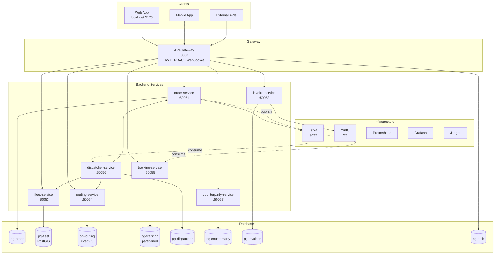

# Logistics Route Optimizer

Open Source система управления логистикой для высоконагруженных операций.

---

## Проблема

Современные логистические операции требуют надежной системы обработки заказов, отслеживания транспорта и автоматической диспетчеризации. Существующие решения сложны в внедрении и не справляются с высокими нагрузками.

## Решение

**Logistics Route Optimizer** — Open Source TMS с enterprise-grade надежностью:

- **Transactional Outbox** — ни одного потерянного события
- **Saga Dispatch** — автоматическая диспетчеризация с retry и компенсацией
- **Идемпотентность** — без дубликатов при любой нагрузке
- **50 000+ сообщений в секунду** — обработка телеметрии без потерь

Устанавливаете на свой сервер — данные никогда не покидают вашу инфраструктуру.

---

## Key Features

| | |
|---|---|
| **Высокие нагрузки** | Backpressure в Kafka consumer, batch записи в PostgreSQL (50k+ rows/sec), партиционирование |
| **Saga Dispatch** | Автоматический подбор ТС, расчёт маршрута, назначение. 5 попыток с exponential backoff |
| **Transaction Outbox** | События пишутся в БД в той же транзакции что и данные — гарантия доставки |
| **Идемпотентность** | Database-based idempotency guards — ни одного дубликата даже при rebalance |
| **PostGIS маршрутизация** | A* алгоритм, кеширование маршрутов, расчёт ETA |
| **PDF Счета** | Генерация через pdfkit, хранение в MinIO/S3 |
| **Безопасность** | JWT + Refresh tokens, RBAC, API Keys, audit logging |

---

## Архитектура



### Сервисы

| Сервис | Ответственность | База данных |
|--------|-----------------|-------------|
| `order-service` | Жизненный цикл заказов, Outbox | PostgreSQL |
| `fleet-service` | Автопарк, PostGIS геозоны | PostgreSQL + PostGIS |
| `routing-service` | Маршруты A*, VRP, ETA | PostgreSQL + PostGIS |
| `tracking-service` | GPS телеметрия, batch writes | PostgreSQL (partitioned) |
| `dispatcher-service` | Saga orchestrator | PostgreSQL |
| `counterparty-service` | Контрагенты, тарифы | PostgreSQL |
| `invoice-service` | Счета, PDF генерация | PostgreSQL + MinIO |
| `api-gateway` | REST API, auth, aggregation | PostgreSQL |

---

## Быстрый старт

```bash
# Клонируем
git clone https://github.com/your-org/logistics-optimizer
cd logistics-optimizer

# Поднимаем всё (инфраструктура + сервисы)
docker compose up -d

# Проверяем
curl http://localhost:3000/health

# Открываем UI
# http://localhost:5173 (фронтенд)
# http://localhost:3000 (API)
```

**Требования**: Docker 24+, Docker Compose 2.20+

---

## Tech Stack

| Компонент | Технология |
|-----------|------------|
| Backend | NestJS, TypeScript |
| База данных | PostgreSQL + PostGIS |
| Message broker | Apache Kafka |
| Inter-service | gRPC |
| Observability | OpenTelemetry, Prometheus, Grafana, Jaeger |
| Frontend | React, Zustand, TanStack Table |

---

## Надёжность

### Transactional Outbox

```typescript
async createOrder(dto) {
  return dataSource.transaction(async (em) => {
    const order = em.create(OrderEntity, dto);
    await em.save(order);
    // Событие в той же транзакции — не потеряется
    await em.save(OutboxEvent, {
      eventType: 'order.created',
      payload: { orderId: order.id, ...dto }
    });
  });
}
```

### Saga Dispatch

```
order.created
  → GetAvailableVehicles   (fleet-service)
  → CalculateRoute         (routing-service)  
  → AssignVehicle          (fleet-service, optimistic lock)
  → UpdateOrderStatus      (order-service)
  → Order Assigned ✓

При ошибке:
  → ReleaseVehicle
  → Retry × 5 (1s → 2s → 4s → 8s → 16s)
  → Order Failed
```

### Backpressure

```
Kafka Consumer → Queue (500) → Batch Writer → PostgreSQL
                              ↓
                        If overloaded:
                          Pause Kafka partition
                          Resume after flush
```

---

## Roadmap

- [ ] Kubernetes Helm charts
- [ ] СМС/Email уведомления
- [ ] Мобильное приложение
- [ ] Интеграции (Wildberries, СДЭК, Деловые Линии)

---

## Contributing

```bash
# Разработка
pnpm install
pnpm start:dev

# Тесты
pnpm test           # Unit
pnpm test:e2e       # E2E

# Линтинг
pnpm lint && pnpm typecheck
```

---

## Документация

Полная документация доступна в директории `docs/`:

| Файл | Содержимое |
|------|------------|
| `docs/README.md` | Обзор архитектуры с диаграммами |
| `docs/SERVICES.md` | Детальное описание каждого сервиса |
| `docs/COMMUNICATION.md` | gRPC методы и Kafka топики |
| `docs/DATABASE.md` | Схемы всех баз данных |
| `docs/API.md` | REST API reference |
| `docs/FEATURES.md` | Паттерны: Outbox, Saga, Idempotency, Backpressure |
| `docs/PROJECT.md` | Product vision и бизнес-фичи |

---

## License

MIT — бесплатно, навсегда, без ограничений.
