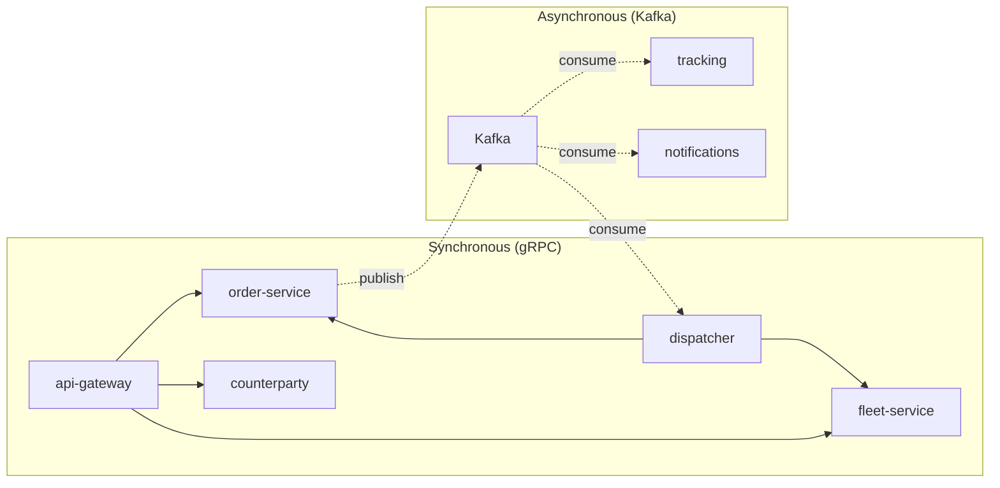
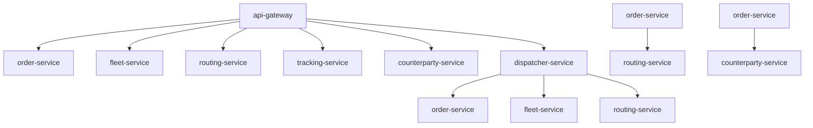
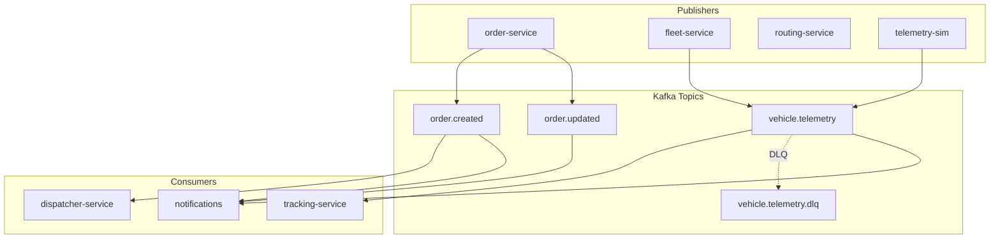

# Service Communication

## Overview

Services communicate via two patterns:
- **Synchronous** — gRPC calls (request/response)
- **Asynchronous** — Kafka events (publish/subscribe)



---

## gRPC Communication

### Service Dependency Map



### gRPC Calls Table

| Caller | Callee | Methods |
|--------|--------|---------|
| api-gateway | order-service | `CreateOrder`, `GetOrder`, `GetOrderHistory`, `ListOrders`, `UpdateOrderStatus`, `CancelOrder`, `GetInvoice`, `GetInvoiceByOrder`, `ListInvoices`, `UpdateInvoiceStatus`, `GetCompanySettings`, `SetSetting`, `UpdateCompanySettings` |
| api-gateway | fleet-service | `GetAvailableVehicles`, `GetVehicle`, `GetVehicleDetails`, `UpdateVehicle`, `AssignVehicle`, `ReleaseVehicle` |
| api-gateway | routing-service | `CalculateRoute`, `GetRoute`, `CalculateETA` |
| api-gateway | counterparty-service | `CreateCounterparty`, `GetCounterparty`, `UpdateCounterparty`, `ListCounterparties`, `CreateContract`, `GetContract`, `UpdateContract`, `ListContracts`, `GetContractTariffs`, `CreateContractTariff` |
| api-gateway | dispatcher-service | `DispatchOrder`, `GetDispatchState`, `CancelDispatch` |
| api-gateway | tracking-service | `GetLatestPosition`, `GetTrack`, `StreamVehiclePosition` |
| dispatcher-service | fleet-service | `GetAvailableVehicles`, `AssignVehicle`, `ReleaseVehicle` |
| dispatcher-service | routing-service | `CalculateRoute` |
| dispatcher-service | order-service | `GetOrder`, `UpdateOrderStatus` |
| order-service | routing-service | `CalculateRoute` |
| order-service | counterparty-service | `GetCounterparty`, `GetContract`, `GetContractTariffs` |

### Injection Tokens

| Token | Service | File |
|-------|---------|------|
| `ORDER_PACKAGE` | OrderService | api-gateway |
| `FLEET_PACKAGE` | FleetService | api-gateway |
| `ROUTING_PACKAGE` | RoutingService | api-gateway |
| `TRACKING_PACKAGE` | TrackingService | api-gateway |
| `COUNTERPARTY_PACKAGE` | CounterpartyService | api-gateway |
| `DISPATCHER_PACKAGE` | DispatcherService | api-gateway |
| `FLEET_SERVICE` | FleetService | dispatcher-service |
| `ROUTING_SERVICE` | RoutingService | dispatcher-service |
| `ORDER_SERVICE` | OrderService | dispatcher-service |

---

## Kafka Communication

### Topics

| Topic | Partitions | Publisher | Consumers |
|-------|------------|-----------|------------|
| `order.created` | 6 | order-service | dispatcher-service, notifications |
| `order.updated` | 6 | order-service | notifications |
| `order.assigned` | 6 | order-service (via dispatcher) | notifications |
| `order.completed` | 6 | order-service | notifications |
| `order.failed` | 6 | order-service | dispatcher-service, notifications |
| `vehicle.status.changed` | 6 | fleet-service | notifications |
| `route.calculated` | 6 | routing-service | — |
| `traffic.incident` | 3 | — | — |
| `vehicle.telemetry` | 12 | telemetry-sim | tracking-service, notifications |
| `outbox.order` | 6 | order-service | — |
| `outbox.dispatcher` | 6 | dispatcher-service | — |
| `vehicle.telemetry.dlq` | 3 | — | — |
| `order.created.dlq` | 3 | — | — |

### Event Flows



### Event Schema

All events follow `KafkaEvent` interface:

```typescript
interface KafkaEvent<T = unknown> {
  eventId: string;        // UUID - unique globally
  source: string;         // Service name
  type: string;           // Event type (e.g., 'order.created')
  aggregateId: string;    // Aggregate root ID
  occurredAt: string;     // ISO-8601 timestamp
  version: number;        // Schema version
  payload: T;             // Event-specific data
}
```

### Event Payloads

#### order.created
```json
{
  "orderId": "uuid",
  "customerId": "uuid",
  "origin": "address string",
  "destination": "address string",
  "priority": "normal|high|urgent",
  "weightKg": 1000,
  "volumeM3": 5.5,
  "slaDeadline": "2024-01-15T12:00:00Z"
}
```

#### order.updated
```json
{
  "orderId": "uuid",
  "previousStatus": "PENDING",
  "newStatus": "ASSIGNED",
  "reason": "Vehicle assigned"
}
```

#### vehicle.telemetry
```json
{
  "vehicleId": "uuid",
  "lat": 55.7558,
  "lng": 37.6173,
  "speed": 45.5,
  "heading": 180.0,
  "recordedAt": "2024-01-15T12:00:00Z"
}
```

---

## Error Handling

### gRPC Errors
- Services return `null` on not found
- `NotFoundException`, `ConflictException` for business errors
- Optimistic locking with version mismatch → Conflict

### Kafka Error Handling

| Pattern | Description |
|---------|-------------|
| Retry | Exponential backoff (1s, 2s, 4s, 8s, 16s) |
| DLQ | Failed events after max retries go to DLQ topic |
| Idempotency | In-memory Set or DB-based deduplication |

### Idempotency Patterns

#### In-Memory (Simple)
```typescript
private readonly processedEvents = new Set<string>();

async handleEvent(event: KafkaEvent) {
  if (this.processedEvents.has(event.eventId)) {
    return; // Skip duplicate
  }
  this.processedEvents.add(event.eventId);

  // Process event...

  // Cleanup to prevent memory leak
  if (this.processedEvents.size > 10_000) {
    const first = this.processedEvents.values().next().value;
    this.processedEvents.delete(first);
  }
}
```

#### Database (Production)
```typescript
// libs/kafka-utils/src/idempotency/idempotency.guard.ts
await dataSource.query(
  `INSERT INTO processed_events (event_id, event_type)
   VALUES ($1, $2)
   ON CONFLICT (event_id) DO NOTHING`,
  [eventId, eventType]
);
```

Required table:
```sql
CREATE TABLE processed_events (
  event_id UUID PRIMARY KEY,
  event_type VARCHAR(100),
  processed_at TIMESTAMPTZ DEFAULT NOW()
);
```