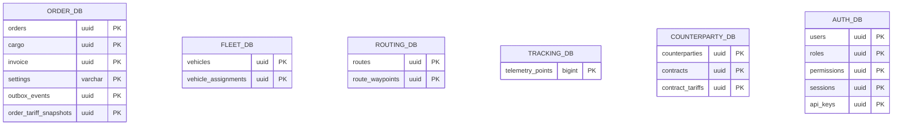

# Database Schemas

## Overview

6 PostgreSQL databases, one per service. Each database is isolated — no cross-service joins.

---

## pg-order (order-service)

### orders (external, extended by init-order.sql)

| Column | Type | Description |
|--------|------|-------------|
| id | UUID | Primary key |
| customer_id | UUID | Customer reference |
| status | VARCHAR | Order status |
| origin_address | TEXT | Origin address |
| destination_address | TEXT | Destination address |
| counterparty_id | UUID | FK → counterparty |
| sender_counterparty_id | UUID | FK → counterparty |
| receiver_counterparty_id | UUID | FK → counterparty |
| contract_id | UUID | FK → contract |
| estimated_price | DECIMAL(12,2) | Estimated price |
| currency | VARCHAR(3) | Currency code |
| tariff_snapshot_id | UUID | FK → order_tariff_snapshots |
| created_at | TIMESTAMPTZ | Creation time |
| updated_at | TIMESTAMPTZ | Last update |
| version | INT | Optimistic lock |

### cargo

| Column | Type | Description |
|--------|------|-------------|
| id | UUID | Primary key |
| order_id | UUID | FK → orders |
| name | VARCHAR(255) | Cargo name |
| quantity | INT | Item count |
| weight_kg | DECIMAL(8,2) | Weight in kg |
| volume_m3 | DECIMAL(8,3) | Volume in m³ |
| packaging | VARCHAR(100) | Packaging type |
| value_rub | DECIMAL(12,2) | Declared value |
| status | VARCHAR(50) | Cargo status |
| version | INT | Optimistic lock |

### invoice

| Column | Type | Description |
|--------|------|-------------|
| id | UUID | Primary key |
| order_id | UUID | FK → orders |
| number | VARCHAR(50) | Invoice number |
| type | VARCHAR(50) | Invoice type |
| amount_rub | DECIMAL(12,2) | Total amount |
| vat_rate | DECIMAL(4,2) | VAT percentage |
| vat_amount | DECIMAL(12,2) | VAT amount |
| status | VARCHAR(50) | Invoice status |
| due_date | DATE | Payment due date |
| paid_at | TIMESTAMPTZ | Payment timestamp |
| counterparty_id | UUID | FK → counterparty |
| contract_id | UUID | FK → contract |
| version | INT | Optimistic lock |
| pdf_url | TEXT | URL to generated PDF (S3/MinIO) |
| pdf_status | VARCHAR(20) | PDF generation status: generating/ready/failed |
| pdf_generated_at | TIMESTAMPTZ | PDF generation timestamp |

### settings

| Column | Type | Description |
|--------|------|-------------|
| key | VARCHAR(100) | Primary key |
| value | TEXT | Setting value |
| created_at | TIMESTAMPTZ | Creation time |
| updated_at | TIMESTAMPTZ | Last update |

**Default Settings:**
| Key | Description |
|-----|-------------|
| company_name | Company legal name |
| company_inn | Tax ID (INN) |
| company_kpp | Registration code (KPP) |
| company_address | Legal address |
| company_phone | Contact phone |
| company_email | Contact email |
| default_payment_terms_days | Default payment terms |
| default_vat_rate | Default VAT rate |

### outbox_events

| Column | Type | Description |
|--------|------|-------------|
| id | UUID | Primary key |
| aggregate_type | VARCHAR(100) | Entity type |
| aggregate_id | UUID | Entity ID |
| event_type | VARCHAR(100) | Event name |
| payload | JSONB | Event data |
| created_at | TIMESTAMPTZ | Creation time |
| processed_at | TIMESTAMPTZ | Kafka publish time |
| retry_count | INT | Retry counter |
| last_error | TEXT | Last error message |

### order_tariff_snapshots

| Column | Type | Description |
|--------|------|-------------|
| id | UUID | Primary key |
| order_id | UUID | FK → orders (unique) |
| price_per_km | DECIMAL(10,2) | Price per km |
| price_per_kg | DECIMAL(10,2) | Price per kg |
| min_price | DECIMAL(10,2) | Minimum price |
| zone | VARCHAR(50) | Pricing zone |
| calculated_at | TIMESTAMPTZ | Calculation time |

### order_status_history

| Column | Type | Description |
|--------|------|-------------|
| id | UUID | Primary key |
| order_id | UUID | FK → orders |
| previous_status | VARCHAR(50) | Previous status |
| new_status | VARCHAR(50) | New status |
| changed_by | UUID | User who changed |
| reason | TEXT | Change reason |
| created_at | TIMESTAMPTZ | Change time |

---

## pg-fleet (fleet-service)

### vehicles

| Column | Type | Description |
|--------|------|-------------|
| id | UUID | Primary key |
| type | VARCHAR(50) | Vehicle type |
| capacity_kg | INT | Load capacity |
| capacity_m3 | DECIMAL(10,2) | Volume capacity |
| status | VARCHAR(50) | Vehicle status |
| current_location | geography(POINT, 4326) | GPS location |
| last_update | TIMESTAMPTZ | Last position update |
| version | INT | Optimistic lock |

### vehicle_assignments

| Column | Type | Description |
|--------|------|-------------|
| id | UUID | Primary key |
| vehicle_id | UUID | FK → vehicles |
| order_id | UUID | Order reference |
| assigned_at | TIMESTAMPTZ | Assignment time |
| released_at | TIMESTAMPTZ | Release time |
| version | INT | Optimistic lock |

---

## pg-routing (routing-service)

### routes

| Column | Type | Description |
|--------|------|-------------|
| id | UUID | Primary key |
| order_id | UUID | Order reference |
| vehicle_id | UUID | Vehicle reference |
| origin | geography(POINT, 4326) | Origin point |
| destination | geography(POINT, 4326) | Destination point |
| distance_meters | INT | Route distance |
| duration_seconds | INT | Estimated duration |
| status | VARCHAR(50) | Route status |
| created_at | TIMESTAMPTZ | Creation time |

### route_waypoints

| Column | Type | Description |
|--------|------|-------------|
| id | UUID | Primary key |
| route_id | UUID | FK → routes |
| sequence | INT | Waypoint order |
| location | geography(POINT, 4326) | Waypoint coordinates |

---

## pg-tracking (tracking-service)

### telemetry_points (Partitioned)

| Column | Type | Description |
|--------|------|-------------|
| id | BIGSERIAL | Primary key |
| vehicle_id | UUID | Vehicle identifier |
| location | GEOMETRY(Point, 4326) | GPS coordinates |
| speed | NUMERIC(6,2) | Speed in km/h |
| heading | NUMERIC(6,2) | Compass heading |
| accuracy | NUMERIC(6,2) | GPS accuracy |
| recorded_at | TIMESTAMPTZ | Device timestamp |
| ingested_at | TIMESTAMPTZ | Ingestion timestamp |
| metadata | JSONB | Additional data |

**Partitioning:** `PARTITION BY RANGE (recorded_at)`

---

## pg-counterparty (counterparty-service)

### counterparties

| Column | Type | Description |
|--------|------|-------------|
| id | UUID | Primary key |
| name | VARCHAR(255) | Company name |
| type | VARCHAR(50) | Type (carrier, shipper) |
| inn | VARCHAR(20) | Tax ID (unique) |
| kpp | VARCHAR(9) | Registration code |
| ogrn | VARCHAR(15) | State reg number |
| address | JSONB | Structured address |
| phone | VARCHAR(50) | Contact phone |
| email | VARCHAR(255) | Contact email |
| version | INT | Optimistic lock |

### contracts

| Column | Type | Description |
|--------|------|-------------|
| id | UUID | Primary key |
| counterparty_id | UUID | FK → counterparties |
| number | VARCHAR(50) | Contract number (unique) |
| valid_from | TIMESTAMPTZ | Start date |
| valid_to | TIMESTAMPTZ | End date |
| status | VARCHAR(50) | Contract status |
| total_limit_rub | DECIMAL(14,2) | Credit limit |
| payment_terms_days | INT | Payment terms |
| version | INT | Optimistic lock |

### contract_tariffs

| Column | Type | Description |
|--------|------|-------------|
| id | UUID | Primary key |
| contract_id | UUID | FK → contracts |
| zone | VARCHAR(50) | Pricing zone |
| price_per_km | DECIMAL(10,2) | Price per km |
| price_per_kg | DECIMAL(10,2) | Price per kg |
| min_price | DECIMAL(10,2) | Minimum price |
| loading_rate | DECIMAL(10,2) | Loading rate |
| unloading_rate | DECIMAL(10,2) | Unloading rate |
| waiting_rate | DECIMAL(10,2) | Waiting rate |
| version | INT | Optimistic lock |

**Constraint:** `UNIQUE(contract_id, zone)`

---

## pg-auth (api-gateway)

### users

| Column | Type | Description |
|--------|------|-------------|
| id | UUID | Primary key |
| email | VARCHAR(255) | Email (unique) |
| password_hash | VARCHAR(255) | Bcrypt hash |
| first_name | VARCHAR(100) | First name |
| last_name | VARCHAR(100) | Last name |
| phone | VARCHAR(20) | Phone |
| is_active | BOOLEAN | Account status |
| is_verified | BOOLEAN | Email verified |
| failed_login_attempts | INT | Failed attempts |
| locked_until | TIMESTAMPTZ | Lockout time |
| deleted_at | TIMESTAMPTZ | Soft delete |

### roles

| Column | Type | Description |
|--------|------|-------------|
| id | UUID | Primary key |
| name | VARCHAR(50) | Role name (unique) |
| description | TEXT | Description |
| is_system | BOOLEAN | System role flag |

**Default Roles:** admin, dispatcher, driver, viewer, api_client

### permissions

| Column | Type | Description |
|--------|------|-------------|
| id | UUID | Primary key |
| name | VARCHAR(100) | Permission name |
| resource | VARCHAR(50) | Resource type |
| action | VARCHAR(50) | Action type |

### user_roles (M:M)

| Column | Type | Description |
|--------|------|-------------|
| user_id | UUID | FK → users |
| role_id | UUID | FK → roles |
| assigned_at | TIMESTAMPTZ | Assignment time |
| assigned_by | UUID | Who assigned |

### role_permissions (M:M)

| Column | Type | Description |
|--------|------|-------------|
| role_id | UUID | FK → roles |
| permission_id | UUID | FK → permissions |

### sessions

| Column | Type | Description |
|--------|------|-------------|
| id | UUID | Primary key |
| user_id | UUID | FK → users |
| device_id | VARCHAR(255) | Device identifier |
| ip_address | INET | Client IP |
| refresh_token_hash | VARCHAR(255) | Token hash |
| expires_at | TIMESTAMPTZ | Session expiry |
| last_used_at | TIMESTAMPTZ | Last activity |

### api_keys

| Column | Type | Description |
|--------|------|-------------|
| id | UUID | Primary key |
| user_id | UUID | FK → users |
| name | VARCHAR(100) | Key name |
| key_hash | VARCHAR(255) | Hashed key |
| key_prefix | VARCHAR(20) | Visible prefix |
| scopes | TEXT[] | Allowed scopes |
| rate_limit | INT | Requests per hour |
| is_active | BOOLEAN | Active status |
| expires_at | TIMESTAMPTZ | Expiration |
| deleted_at | TIMESTAMPTZ | Soft delete |

### refresh_tokens

| Column | Type | Description |
|--------|------|-------------|
| id | UUID | Primary key |
| user_id | UUID | FK → users |
| token_hash | VARCHAR(255) | Token hash |
| family | VARCHAR(36) | Token family |
| expires_at | TIMESTAMPTZ | Expiration |
| revoked_at | TIMESTAMPTZ | Revocation time |

### audit_logs

| Column | Type | Description |
|--------|------|-------------|
| id | UUID | Primary key |
| user_id | UUID | FK → users |
| action | VARCHAR(100) | Action performed |
| resource | VARCHAR(100) | Resource type |
| resource_id | UUID | Resource ID |
| changes | JSONB | Change delta |
| ip_address | INET | Client IP |

---

## Cross-Database References

| From | To | Type |
|------|----|------|
| orders.counterparty_id | counterparty.id | FK (external) |
| orders.contract_id | contract.id | FK (external) |
| orders.tariff_snapshot_id | order_tariff_snapshots.id | FK |
| invoice.counterparty_id | counterparty.id | FK (external) |
| invoice.contract_id | contract.id | FK (external) |
| contract.counterparty_id | counterparty.id | FK |
| contract_tariff.contract_id | contract.id | FK |