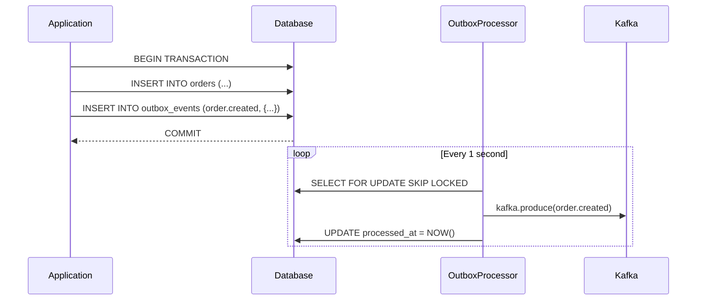
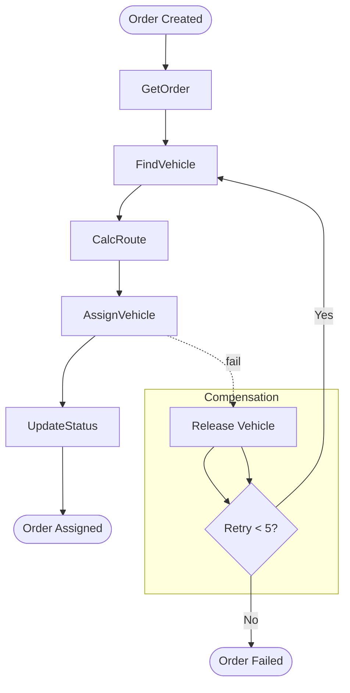
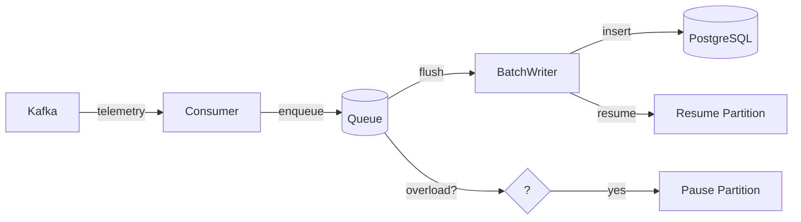
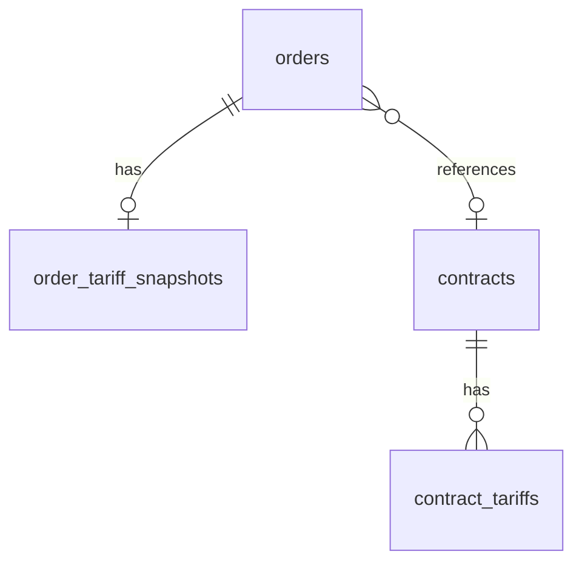
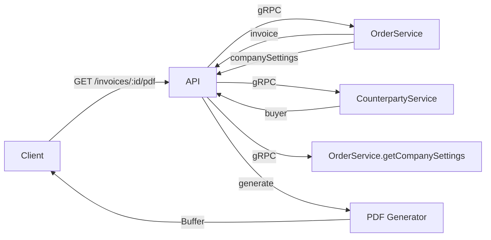

# Key Features and Patterns

## Transactional Outbox

Ensures reliable event delivery to Kafka by writing events in the same transaction as data changes.

### Problem
Publishing to Kafka after DB commit creates a window where DB succeeds but Kafka fails → lost events.

### Solution
Write events to an outbox table in the same transaction. A separate processor polls and publishes.



### Implementation

**Entity:** `apps/order-service/src/order/entities/outbox-event.entity.ts`

```typescript
@Entity('outbox_events')
export class OutboxEventEntity {
  @PrimaryGeneratedColumn('uuid') id!: string;
  @Column({ name: 'aggregate_type' }) aggregateType!: string;
  @Column({ name: 'aggregate_id', type: 'uuid' }) aggregateId!: string;
  @Column({ name: 'event_type' }) eventType!: string;
  @Column({ type: 'jsonb' }) payload!: Record<string, unknown>;
  @CreateDateColumn({ name: 'created_at' }) createdAt!: Date;
  @Column({ name: 'processed_at', nullable: true }) @Index() processedAt?: Date;
  @Column({ name: 'retry_count', default: 0 }) retryCount!: number;
  @Column({ name: 'last_error', nullable: true }) lastError?: string;
}
```

**Processor:** `apps/order-service/src/order/outbox/outbox.processor.ts`

```typescript
async processOutbox() {
  const events = await this.outboxRepo
    .createQueryBuilder('e')
    .where('e.processed_at IS NULL')
    .andWhere('e.retry_count < :maxRetries', { maxRetries: 5 })
    .orderBy('e.created_at', 'ASC')
    .setLock('pessimistic_write')
    .take(50)
    .getMany();

  for (const event of events) {
    try {
      await this.kafkaProducer.send({
        topic: `order.${event.eventType}`,
        messages: [{
          key: event.aggregateId,
          value: JSON.stringify(event.payload),
        }],
      });
      event.processedAt = new Date();
    } catch (error) {
      event.retryCount++;
      event.lastError = (error as Error).message;
    }
    await this.outboxRepo.save(event);
  }
}
```

**Usage:**
```typescript
async createOrder(dto: CreateOrderDto) {
  return this.dataSource.transaction(async (em) => {
    const order = em.create(OrderEntity, dto);
    await em.save(order);

    const event = em.create(OutboxEventEntity, {
      aggregateType: 'Order',
      aggregateId: order.id,
      eventType: 'created',
      payload: { orderId: order.id, ...dto },
    });
    await em.save(event);

    return order;
  });
}
```

---

## Idempotent Consumers

Prevents duplicate event processing. Two patterns: in-memory and database-based.

### In-Memory (Simple, Limited)

```typescript
export class OrderEventsConsumer {
  private readonly processedEvents = new Set<string>();

  async handleEvent(event: KafkaEvent) {
    if (this.processedEvents.has(event.eventId)) {
      this.logger.debug(`Skipping duplicate: ${event.eventId}`);
      return;
    }

    await this.processEvent(event);
    this.processedEvents.add(event.eventId);

    // Memory management
    if (this.processedEvents.size > 10_000) {
      const first = this.processedEvents.values().next().value;
      this.processedEvents.delete(first);
    }
  }
}
```

### Database-Based (Production)

**IdempotencyGuard:** `libs/kafka-utils/src/idempotency/idempotency.guard.ts`

```typescript
async tryAcquire(eventId: string, eventType: string): Promise<boolean> {
  const result = await this.dataSource.query(
    `INSERT INTO processed_events (event_id, event_type)
     VALUES ($1, $2)
     ON CONFLICT (event_id) DO NOTHING
     RETURNING id`,
    [eventId, eventType]
  );
  return result.length > 0;
}
```

Required table:
```sql
CREATE TABLE processed_events (
  event_id UUID PRIMARY KEY,
  event_type VARCHAR(100),
  processed_at TIMESTAMPTZ DEFAULT NOW()
);
```

---

## Dispatch Saga

Orchestrates the order dispatch flow with compensation on failure.



### Saga Steps

| Step | Service | Action |
|------|---------|--------|
| 1 | order-service | Get order details |
| 2 | fleet-service | Find available vehicle |
| 3 | routing-service | Calculate route |
| 4 | fleet-service | Assign vehicle (optimistic lock) |
| 5 | order-service | Update status to ASSIGNED |

### Compensation

On any failure:
1. Release assigned vehicle (if any)
2. Retry with exponential backoff (1s → 2s → 4s → 8s → 16s)
3. After 5 retries → mark order as FAILED

### Implementation

```typescript
async executeDispatch(orderId: string) {
  for (let attempt = 1; attempt <= 5; attempt++) {
    try {
      const order = await this.orderService.getOrder(orderId);

      const vehicle = await this.fleetService.getAvailableVehicles({
        origin: order.origin,
        capacity: order.cargoWeight,
      });

      const route = await this.routingService.calculateRoute({
        origin: order.origin,
        destination: order.destination,
      });

      await this.fleetService.assignVehicle({
        vehicleId: vehicle.id,
        orderId: orderId,
        version: vehicle.version,
      });

      await this.orderService.updateOrderStatus({
        orderId,
        status: 'ASSIGNED',
        reason: `Vehicle ${vehicle.id} assigned`,
      });

      return { success: true, vehicleId: vehicle.id };
    } catch (error) {
      if (attempt < 5) {
        const delay = Math.pow(2, attempt - 1) * 1000;
        await this.sleep(delay);
      }
    }
  }

  await this.orderService.updateOrderStatus({
    orderId,
    status: 'FAILED',
    reason: 'Dispatch failed after 5 retries',
  });

  return { success: false };
}
```

---

## Backpressure (Tracking Service)

Protects database from being overwhelmed by high-throughput telemetry.

### Problem
300 vehicles × 2 Hz = 600 messages/sec → batch writes needed but can overload DB.

### Solution
1. Accumulate in memory queue
2. Flush every 200ms OR when queue reaches 500 records
3. Pause Kafka partition if writer is overloaded



### Implementation

```typescript
export class TelemetryConsumer {
  private queue: TelemetryPoint[] = [];
  private lastFlush = Date.now();
  private pausedPartitions = new Set<number>();

  async handleTelemetry(data: TelemetryData, partition: number) {
    if (this.pausedPartitions.has(partition)) {
      return; // Skip while paused
    }

    this.queue.push(data);

    // Backpressure check
    if (this.batchWriter.isOverloaded()) {
      this.kafkaConsumer.pause([partition]);
      this.pausedPartitions.add(partition);
      this.batchWriter.onNextFlush(() => {
        this.kafkaConsumer.resume([partition]);
        this.pausedPartitions.delete(partition);
      });
    }

    // Flush conditions
    const shouldFlush =
      this.queue.length >= 500 ||
      Date.now() - this.lastFlush >= 200;

    if (shouldFlush) {
      await this.flush();
    }
  }

  private async flush() {
    if (this.queue.length === 0) return;

    const batch = this.queue.splice(0);
    await this.batchWriter.write(batch);
    this.lastFlush = Date.now();
  }
}
```

### Performance
- ~50,000 rows/sec with bulk INSERT via `unnest()`
- Partitioning by time for efficient data lifecycle

---

## Optimistic Locking

Prevents concurrent updates from overwriting each other.

### Pattern
```typescript
async updateOrder(id: string, dto: UpdateOrderDto, expectedVersion: number) {
  const order = await this.orderRepo.findOne({ where: { id } });

  if (order.version !== expectedVersion) {
    throw new ConflictException('Version conflict - order was modified');
  }

  order.version++;
  Object.assign(order, dto);

  return this.orderRepo.save(order);
}
```

### Usage in gRPC
```typescript
await fleetService.assignVehicle({
  vehicleId: vehicle.id,
  orderId: orderId,
  version: vehicle.version, // Expected version
});
```

### Database
```sql
UPDATE vehicles
SET status = 'in_transit', version = version + 1
WHERE id = $1 AND version = $2
RETURNING *;
-- If no rows affected → ConflictException
```

---

## Company Settings

Key-value storage for company configuration used in invoice PDF generation.

### Settings Table
```sql
CREATE TABLE settings (
  key VARCHAR(100) PRIMARY KEY,
  value TEXT NOT NULL,
  created_at TIMESTAMPTZ DEFAULT NOW(),
  updated_at TIMESTAMPTZ DEFAULT NOW()
);
```

### Default Settings
| Key | Description |
|-----|-------------|
| company_name | Legal company name |
| company_inn | Tax ID (INN) |
| company_kpp | Registration code (KPP) |
| company_address | Legal address |
| company_phone | Contact phone |
| company_email | Contact email |
| default_payment_terms_days | Default payment terms |
| default_vat_rate | Default VAT percentage |

### Usage in Invoice PDF

```typescript
const settings = await orderService.getCompanySettings();

const invoiceData = {
  seller: {
    name: settings.companyName,
    inn: settings.companyInn,
    kpp: settings.companyKpp,
    address: settings.companyAddress,
    phone: settings.companyPhone,
  },
  paymentTerms: `${settings.defaultPaymentTermsDays} дней`,
  vatRate: invoice.vatRate || settings.defaultVatRate,
};
```

### REST API
```
GET  /settings/company     → Get all company settings
PUT  /settings/company     → Update company settings (admin)
```

---

## Tariff Snapshots

Preserves pricing at order creation time to prevent retroactive price changes.

### Problem
Contract tariffs can change. Orders created today shouldn't be affected by tomorrow's price changes.

### Solution
Copy tariff data to a snapshot table at order creation.



### Snapshot Table
```sql
CREATE TABLE order_tariff_snapshots (
  id UUID PRIMARY KEY,
  order_id UUID UNIQUE REFERENCES orders(id),
  price_per_km DECIMAL(10,2),
  price_per_kg DECIMAL(10,2),
  min_price DECIMAL(10,2),
  zone VARCHAR(50),
  calculated_at TIMESTAMPTZ
);
```

### Usage
1. On order creation, get applicable contract tariff
2. Copy tariff values to `order_tariff_snapshots`
3. Link order to snapshot via `tariff_snapshot_id`
4. All price calculations use snapshot, not current tariff

---

## Invoice PDF Generation

Generates professional invoices as PDF documents.

### Flow


### PDF Content
- Invoice header with number and date
- Seller info (from company settings)
- Buyer info (from counterparty)
- Line items
- Subtotal, VAT, Total
- Payment terms

### Implementation

```typescript
// libs/document-templates/src/invoice.ts
export async function generateInvoice(data: InvoicePdfData): Promise<Uint8Array> {
  const doc = new PDFDocument({ size: 'A4', margin: 50 });

  // Header
  doc.text(`СЧЁТ № ${data.number}`, { align: 'center' });
  doc.text(`от ${data.date}`, { align: 'center' });

  // Seller
  doc.text('Продавец:', { underline: true });
  doc.text(`${data.seller.name}`);
  doc.text(`ИНН: ${data.seller.inn}, КПП: ${data.seller.kpp}`);
  doc.text(data.seller.address);

  // Buyer
  doc.text('Покупатель:', { underline: true });
  doc.text(`${data.buyer.name}`);
  doc.text(`ИНН: ${data.buyer.inn}`);
  doc.text(data.buyer.address);

  // Items table
  // ...

  // Totals
  doc.text(`Итого: ${data.total} ₽`);
  doc.text(`НДС ${data.vatRate}%: ${data.vatAmount} ₽`);

  // Payment terms
  doc.text(`Срок оплаты: ${data.paymentTerms}`);

  return doc.end();
}
```

### Endpoint
```
GET /invoices/:id/pdf
Content-Type: application/pdf
Content-Disposition: attachment; filename="invoice-{number}.pdf"
```