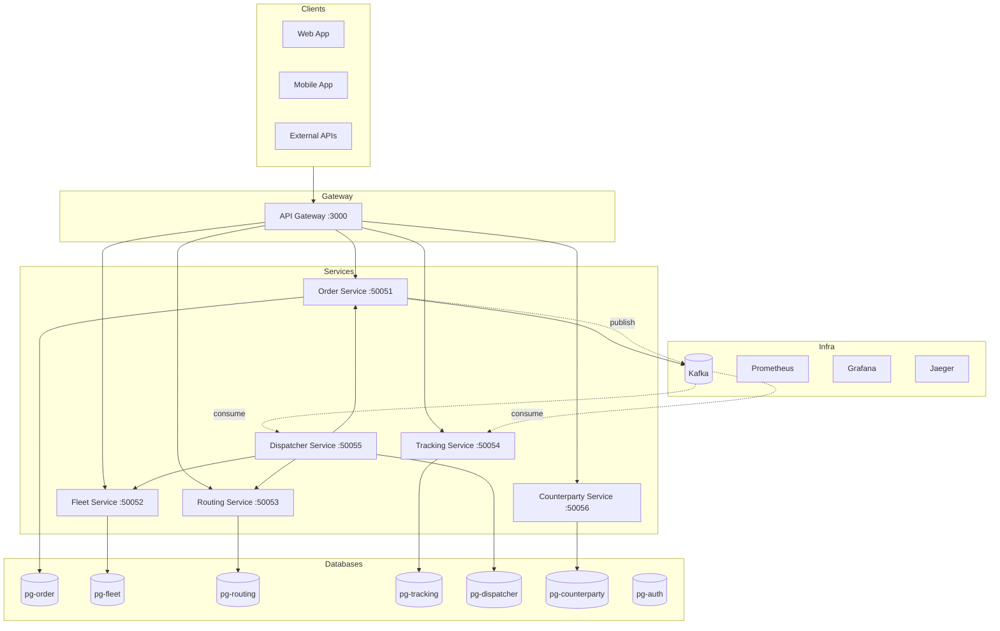

# Logistics Optimizer — Knowledge Base

## Overview

Микросервисная система оптимизации логистических маршрутов для грузоперевозок.

## Architecture Overview



## Quick Links

| Document | Description |
|----------|-------------|
| [PROJECT.md](./PROJECT.md) | Product vision, business features, MVP scope |
| [SERVICES.md](./SERVICES.md) | Detailed service descriptions |
| [COMMUNICATION.md](./COMMUNICATION.md) | Service communication patterns |
| [DATABASE.md](./DATABASE.md) | Database schemas |
| [API.md](./API.md) | REST API reference |
| [FEATURES.md](./FEATURES.md) | Key patterns and features |

## Tech Stack

| Component | Technology |
|-----------|------------|
| Language | TypeScript |
| Framework | NestJS |
| Database | PostgreSQL + PostGIS |
| Message Queue | Apache Kafka |
| API | gRPC (inter-service) + REST (client) |
| Auth | JWT + API Keys |
| Container | Docker Compose |
| Monorepo | Nx |

## Services Overview

| Service | Port | Database | Responsibilities |
|---------|------|----------|------------------|
| `api-gateway` | 3000 | — | REST API, auth, gRPC aggregation |
| `order-service` | 50051 | pg-order | Orders, invoices, settings |
| `fleet-service` | 50052 | pg-fleet | Vehicles, drivers |
| `routing-service` | 50053 | pg-routing | Routes, A*, ETA |
| `tracking-service` | 50054 | pg-tracking | GPS telemetry |
| `dispatcher-service` | 50055 | pg-dispatcher | Saga orchestrator |
| `counterparty-service` | 50056 | pg-counterparty | Contracts, tariffs |

## Key Patterns

| Pattern | Service | Purpose |
|---------|---------|---------|
| Transactional Outbox | order-service, dispatcher | Reliable event delivery |
| Idempotent Consumers | All Kafka consumers | Duplicate prevention |
| Dispatch Saga | dispatcher-service | Orchestrated dispatch flow |
| Backpressure | tracking-service | Overload protection |
| Optimistic Locking | All services | Concurrency control |

## Getting Started

```bash
# Install dependencies
pnpm install

# Start infrastructure
docker compose up -d

# Wait for ready (30-60 sec)
docker compose ps

# Start services
pnpm start:dev
```

## Environment

```bash
# Required environment variables
JWT_SECRET=<secret>
PG_USER=logistics
PG_PASSWORD=logistics_secret
KAFKA_BROKER=kafka:9092
```

## Observability

| Tool | URL | Purpose |
|------|-----|---------|
| Grafana | http://localhost:3001 | Dashboards |
| Jaeger | http://localhost:16686 | Tracing |
| Kafka UI | http://localhost:8080 | Kafka management |
| Prometheus | http://localhost:9090 | Metrics |