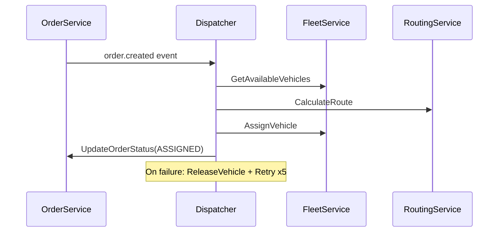

# Services

## order-service

**Port:** gRPC 50051, HTTP 3011  
**Database:** pg-order (PostgreSQL)  
**Package:** `order`

### Responsibilities
- Order lifecycle management (CRUD, state machine)
- Invoice generation with PDF
- Company settings management
- Transactional Outbox for event publishing

### Main Entities
- `Order` — Core order entity with status machine
- `Cargo` — Cargo items attached to orders
- `Document` — Documents (waybills, contracts)
- `Invoice` — Invoices with VAT calculation
- `SettingEntity` — Key-value company settings
- `OrderTariffSnapshot` — Historical tariff at order time
- `OutboxEvent` — Event outbox for Kafka
- `OrderStatusHistory` — Status change audit trail

### gRPC Methods
```protobuf
service OrderService {
  CreateOrder, GetOrder, GetOrderHistory, ListOrders
  UpdateOrderStatus, CancelOrder
  GetInvoice, GetInvoiceByOrder, ListInvoices, UpdateInvoiceStatus
  GetCompanySettings, SetSetting, UpdateCompanySettings
}
```

### Kafka Topics Published
- `order.created` — New order created
- `order.updated` — Order status changed

### Key Features
- Transactional Outbox pattern for reliable event delivery
- Optimistic locking on orders and invoices
- Tariff snapshots to preserve pricing at order time
- Company settings for invoice PDF generation
- Invoice PDF generation with seller/buyer info

---

## fleet-service

**Port:** gRPC 50052, HTTP 3012  
**Database:** pg-fleet (PostgreSQL + PostGIS)  
**Package:** `fleet`

### Responsibilities
- Vehicle management
- Driver assignment
- PostGIS queries for proximity search

### Main Entities
- `Vehicle` — Fleet vehicles with PostGIS location
- `Driver` — Driver profiles
- `VehicleAssignment` — Order-vehicle assignments

### gRPC Methods
```protobuf
service FleetService {
  GetAvailableVehicles, GetVehicle, GetVehicleDetails
  UpdateVehicle, AssignVehicle, ReleaseVehicle
  GetVehicleLocation (stream)
}
```

### Key Features
- PostGIS for geographic queries (find nearest vehicle)
- Optimistic locking on vehicles
- Vehicle status tracking (idle, in_transit, maintenance)

---

## routing-service

**Port:** gRPC 50053, HTTP 3013  
**Database:** pg-routing (PostgreSQL + PostGIS)  
**Package:** `routing`

### Responsibilities
- Route calculation between points
- ETA estimation
- Route caching

### Main Entities
- `Route` — Calculated routes
- `RouteWaypoint` — Route polyline points

### gRPC Methods
```protobuf
service RoutingService {
  CalculateRoute, GetRoute, CalculateETA
}
```

### Key Features
- PostGIS for route calculation
- Route caching for performance
- Support for traffic conditions

---

## tracking-service

**Port:** gRPC 50054  
**Database:** pg-tracking (PostgreSQL + PostGIS)  
**Package:** `tracking`

### Responsibilities
- High-throughput GPS telemetry ingestion
- Vehicle position streaming
- Route tracking

### Main Entities
- `TelemetryPoint` — GPS points (partitioned by time)

### gRPC Methods
```protobuf
service TrackingService {
  GetLatestPosition, GetTrack
  StreamVehiclePosition (stream)
  TrackVehicle (bidirectional stream)
}
```

### Key Features
- Batch writes for high throughput (~50k rows/sec)
- Backpressure with Kafka partition pause/resume
- Time-based partitioning on telemetry_points
- PostGIS for geospatial queries

---

## dispatcher-service

**Port:** gRPC 50055  
**Database:** pg-dispatcher (PostgreSQL)  
**Package:** `dispatcher`

### Responsibilities
- Saga orchestrator for order dispatch
- Find vehicle, calculate route, assign to order
- Compensation on failure

### Main Entities
- `OutboxEvent` — Event outbox (same pattern as order-service)

### gRPC Methods
```protobuf
service DispatcherService {
  DispatchOrder, GetDispatchState
  RetryDispatch, CancelDispatch
}
```

### Kafka Topics Consumed
- `order.created` — Trigger dispatch saga
- `order.failed` — Handle failed orders

### Dispatch Saga Flow


### Key Features
- Saga pattern with compensation
- Exponential backoff retry (1s → 2s → 4s → 8s → 16s)
- Optimistic locking on vehicle assignment

---

## counterparty-service

**Port:** gRPC 50056, HTTP 3016  
**Database:** pg-counterparty (PostgreSQL)  
**Package:** `counterparty`

### Responsibilities
- Counterparty (carrier, shipper) management
- Contract management
- Contract tariff pricing

### Main Entities
- `Counterparty` — Companies/entities (carriers, warehouses)
- `Contract` — Contracts with counterparties
- `ContractTariff` — Zone-based pricing

### gRPC Methods
```protobuf
service CounterpartyService {
  CreateCounterparty, GetCounterparty, UpdateCounterparty, ListCounterparties
  CreateContract, GetContract, UpdateContract, ListContracts
  GetContractTariffs, CreateContractTariff
}
```

### Key Features
- Optimistic locking on contracts and tariffs
- Zone-based pricing (price_per_km, price_per_kg, min_price)
- Support for loading/unloading/waiting rates

---

## api-gateway

**Port:** HTTP 3000  
**Database:** pg-auth (PostgreSQL)  
**Auth:** JWT + API Keys

### Responsibilities
- REST API for clients
- JWT authentication
- gRPC service aggregation
- Role-based access control (RBAC)
- WebSocket notifications

### REST Modules
- `auth` — Login, register, token refresh
- `orders` — Order CRUD via gRPC
- `vehicles` — Vehicle listing via gRPC
- `tracking` — Location tracking via gRPC
- `counterparties` — Counterparty management via gRPC
- `invoices` — Invoice listing + PDF download via gRPC
- `settings` — Company settings management via gRPC
- `admin` — User management, audit logs

### gRPC Clients
| Service | Token | Methods Used |
|---------|-------|---------------|
| OrderService | `ORDER_PACKAGE` | Orders, invoices, settings |
| CounterpartyService | `COUNTERPARTY_PACKAGE` | Counterparties, contracts |
| FleetService | `FLEET_PACKAGE` | Vehicles |
| RoutingService | `ROUTING_PACKAGE` | Routes |
| DispatcherService | `DISPATCHER_PACKAGE` | Dispatch |
| TrackingService | `TRACKING_PACKAGE` | Tracking |

### Kafka Consumers
- `order.created` → WebSocket notification
- `order.assigned` → WebSocket + driver info
- `order.completed` → WebSocket notification
- `order.failed` → WebSocket notification
- `vehicle.telemetry` → "Near destination" alert

### Key Features
- JWT with refresh tokens
- API Keys for external access
- Rate limiting (throttler)
- Audit logging
- WebSocket notifications via Socket.io

---

## auth-service (integrated in api-gateway)

**Database:** pg-auth (PostgreSQL)  
**Entities in pg-auth:**
- `User` — User accounts
- `Role` — Roles (admin, dispatcher, driver, viewer, api_client)
- `Permission` — Granular permissions
- `Session` — Active sessions
- `ApiKey` — API keys
- `RefreshToken` — Token families for revocation
- `AuditLog` — Action audit trail

### Default Roles & Permissions
| Role | Permissions |
|------|-------------|
| admin | All permissions |
| dispatcher | orders.*, vehicles.*, tracking.read, routes.*, dispatch.* |
| driver | orders.read, orders.update, vehicles.read, tracking.write |
| viewer | orders.read, vehicles.read, tracking.read, routes.read |
| api_client | orders.create, orders.read, vehicles.read, tracking.read |

### Key Features
- Bcrypt password hashing
- Account lockout after failed attempts
- Token family for batch revocation
- Soft delete on users and API keys
- Permission wildcard matching (`orders.*`)